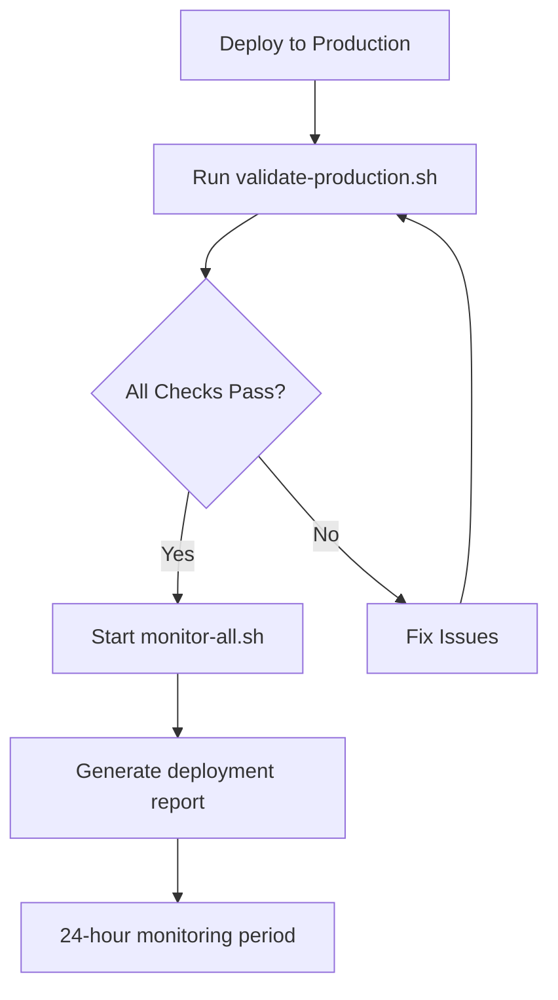
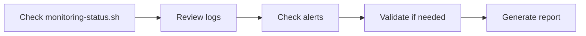
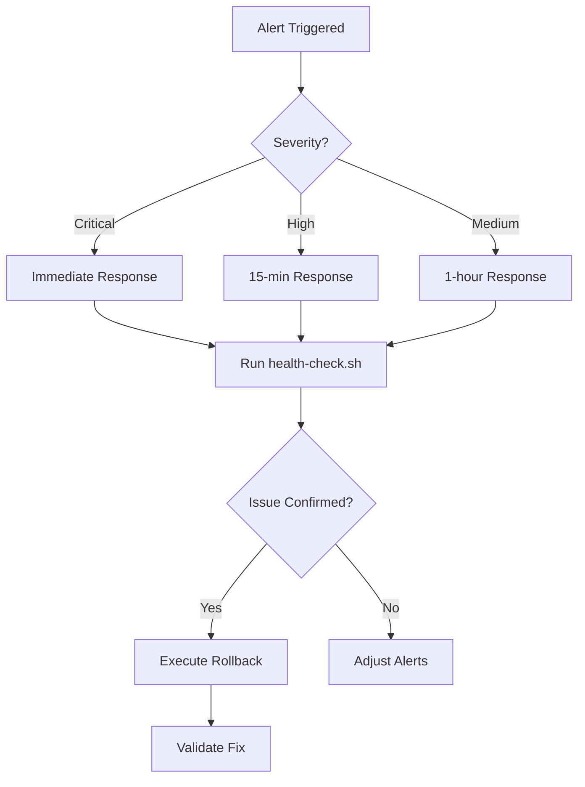

# Production Monitoring - Complete Index

This index provides a comprehensive overview of all monitoring documentation and scripts.

---

## Quick Access

- **Get Started**: [Quick Start Guide](./QUICK_START_MONITORING.md) - 5-minute setup
- **Full Documentation**: [Monitoring Guide](./MONITORING_GUIDE.md) - Complete reference
- **Scripts Reference**: [Scripts README](../scripts/README.md) - All monitoring scripts

---

## Documentation Files

### Setup & Getting Started

| Document | Description | Time Required |
|----------|-------------|---------------|
| [QUICK_START_MONITORING.md](./QUICK_START_MONITORING.md) | Fast setup guide | 5 minutes |
| [MONITORING_GUIDE.md](./MONITORING_GUIDE.md) | Comprehensive monitoring documentation | Reference |
| [scripts/README.md](../scripts/README.md) | Scripts overview and usage | Reference |

### Configuration & Reference

| Document | Description |
|----------|-------------|
| [ROLLBACK_PROCEDURES.md](./ROLLBACK_PROCEDURES.md) | Emergency rollback procedures |
| [DEPLOYMENT_CHECKLIST.md](./DEPLOYMENT_CHECKLIST.md) | Pre/post deployment checklist |
| [alerts-config.example.json](../scripts/alerts-config.example.json) | Alert configuration template |

---

## Monitoring Scripts

### Core Monitoring Scripts (11 total)

#### Validation & Testing

| Script | Purpose | Run Time |
|--------|---------|----------|
| `validate-production.sh` | 8-point validation suite | ~30 seconds |
| `health-check.sh` | Quick availability check | ~5 seconds |

#### Continuous Monitoring

| Script | Purpose | Run Time |
|--------|---------|----------|
| `continuous-monitor.sh` | Real-time monitoring loop | Continuous |
| `performance-dashboard.sh` | Live performance dashboard | Continuous |
| `security-event-monitor.sh` | Security event tracking | Continuous |

#### Control Scripts

| Script | Purpose | Run Time |
|--------|---------|----------|
| `monitor-all.sh` | Start all monitoring services | ~5 seconds |
| `stop-monitoring.sh` | Stop all monitoring services | ~5 seconds |
| `monitoring-status.sh` | Check monitoring status | ~2 seconds |

#### Configuration & Reporting

| Script | Purpose | Run Time |
|--------|---------|----------|
| `setup-alerts.sh` | Configure alert system | ~5 seconds |
| `generate-deployment-report.sh` | Generate deployment report | ~10 seconds |

---

## Validation Checks (8 Total)

The validation suite performs these checks:

| # | Check | Description | Expected Result |
|---|-------|-------------|-----------------|
| 1 | Application Availability | HTTP response from homepage | 200 OK |
| 2 | Security Headers | X-Frame-Options, CSP, XCO, HSTS | All present |
| 3 | Debug Endpoints | /api/debug-profile protection | 403 Forbidden |
| 4 | CSRF Protection | POST without token | 403 Forbidden |
| 5 | Rate Limiting | X-RateLimit headers | Headers present |
| 6 | Authentication | Protected endpoints | 401/403 |
| 7 | Firebase Integration | Firestore/Storage connectivity | Manual check |
| 8 | Error Handling | Stack trace sanitization | Manual check |

---

## Monitoring Capabilities

### What We Monitor

#### Performance Metrics

- HTTP response codes
- Response time (ms)
- Endpoint availability
- Request throughput
- Error rates

#### Security Events

- Failed authentication attempts
- CSRF validation failures
- Rate limit violations
- SSRF attempt blocks
- Unauthorized access attempts
- Debug endpoint access

#### System Health

- Application availability
- API endpoint status
- Database connectivity
- External service health
- Resource utilization

---

## Alert Configuration

### Alert Severity Levels

| Level | Response Time | Example Trigger |
|-------|---------------|-----------------|
| CRITICAL | Immediate | Application down, security breach |
| HIGH | < 15 min | High error rate, failed deploys |
| MEDIUM | < 1 hour | Authentication failures spike |
| LOW | < 4 hours | Rate limiting events |
| WARNING | Next day | Performance degradation |

### Notification Channels

- **Email**: Critical and high alerts
- **Slack**: All alerts (configurable by severity)
- **PagerDuty**: Critical alerts only (optional)

### Alert Thresholds (Default)

| Metric | Warning | Critical |
|--------|---------|----------|
| Response Time | 2000ms | 5000ms |
| Error Rate | 1% | 5% |
| HTTP Status | 4xx | 5xx |
| Failed Auth | 50/hour | 100/hour |
| CSRF Failures | 20/hour | 50/hour |

---

## Log Files

### Log Locations

```
logs/
├── continuous-monitor.log     # Real-time monitoring results
├── security-events.log        # Security event tracking
├── monitoring-YYYYMMDD.log   # Daily monitoring logs
├── security-events-YYYYMMDD.log  # Daily security logs
└── *.pid                      # Process ID files
```

### Log Retention

- **Active logs**: Current day
- **Daily logs**: 90 days
- **Rotation**: Automatic at midnight
- **Max size**: 100MB per file

---

## Monitoring Workflows

### Initial Deployment



### Daily Monitoring



### Incident Response



---

## Usage Patterns

### First 24 Hours Post-Deployment

```bash
# Hour 0: Deploy
./scripts/validate-production.sh https://myapp.com
./scripts/monitor-all.sh https://myapp.com
./scripts/generate-deployment-report.sh

# Every 2 hours: Check
./scripts/monitoring-status.sh
tail -50 logs/continuous-monitor.log

# Hour 24: Review
./scripts/generate-deployment-report.sh
./scripts/validate-production.sh https://myapp.com
```

### First Week

```bash
# Daily
./scripts/validate-production.sh https://myapp.com
./scripts/generate-deployment-report.sh

# Review logs
tail -100 logs/continuous-monitor.log
tail -100 logs/security-events.log
```

### Ongoing

```bash
# Weekly
./scripts/validate-production.sh https://myapp.com
./scripts/generate-deployment-report.sh

# Monthly
# Full security audit
# Performance baseline review
# Alert threshold adjustment
```

---

## Integration Points

### CI/CD Integration

```yaml
# GitHub Actions example
post-deploy:
  runs-on: ubuntu-latest
  steps:
    - name: Validate Production
      run: ./scripts/validate-production.sh ${{ secrets.PRODUCTION_URL }}

    - name: Start Monitoring
      run: ./scripts/monitor-all.sh ${{ secrets.PRODUCTION_URL }}

    - name: Generate Report
      run: ./scripts/generate-deployment-report.sh
```

### Scheduled Monitoring

```bash
# Crontab examples
# Hourly validation
0 * * * * /path/to/scripts/validate-production.sh https://myapp.com

# Daily report
0 0 * * * /path/to/scripts/generate-deployment-report.sh

# Weekly status check
0 9 * * 1 /path/to/scripts/monitoring-status.sh
```

---

## Dependencies

### Required Tools

| Tool | Purpose | Install |
|------|---------|---------|
| curl | HTTP requests | `apt install curl` / `brew install curl` |
| bc | Math calculations | `apt install bc` / `brew install bc` |
| grep | Pattern matching | Built-in |
| sed | Text processing | Built-in |
| tail | Log viewing | Built-in |

### Optional Tools

| Tool | Purpose | Install |
|------|---------|---------|
| jq | JSON processing | `apt install jq` / `brew install jq` |
| mailx | Email sending | `apt install mailx` |
| gh | GitHub CLI | `apt install gh` / `brew install gh` |

---

## Performance Baselines

### Expected Metrics (After Warmup)

| Metric | Target | Acceptable | Critical |
|--------|--------|------------|----------|
| Homepage Response | < 500ms | < 2s | > 5s |
| API Response | < 1s | < 3s | > 10s |
| Uptime | 99.9% | 99.5% | < 99% |
| Error Rate | < 0.1% | < 1% | > 5% |

### Traffic Expectations

- Normal: 100-1000 req/min
- Peak: 2000-5000 req/min
- Alert if: > 3x baseline

---

## Troubleshooting Quick Reference

| Issue | Quick Fix |
|-------|-----------|
| Scripts won't execute | `chmod +x scripts/*.sh` |
| Monitoring not logging | Check logs directory exists |
| Alerts not sending | Verify SLACK_WEBHOOK_URL set |
| High response times | Run performance dashboard |
| Validation failing | Review specific failed checks |
| Can't stop monitoring | `pkill -f monitor` |

---

## Best Practices Checklist

### Pre-Deployment

- [ ] Review monitoring documentation
- [ ] Test scripts on staging
- [ ] Configure alert channels
- [ ] Set baseline expectations
- [ ] Prepare rollback plan

### Post-Deployment

- [ ] Run validation immediately
- [ ] Start continuous monitoring
- [ ] Generate initial report
- [ ] Monitor for 24 hours minimum
- [ ] Review logs daily (first week)

### Ongoing

- [ ] Weekly validation runs
- [ ] Monthly performance reviews
- [ ] Quarterly security audits
- [ ] Alert threshold tuning
- [ ] Documentation updates

---

## Success Metrics

### Deployment Success

- ✅ All 8 validation checks pass
- ✅ 24-hour monitoring completed
- ✅ No critical alerts triggered
- ✅ Response times within baselines
- ✅ Error rate < 0.1%

### Monitoring Effectiveness

- ✅ Alert response time < SLA
- ✅ False positive rate < 5%
- ✅ Issue detection before users
- ✅ Complete incident documentation
- ✅ Continuous improvement cycle

---

## Support & Resources

### Documentation

- [Monitoring Guide](./MONITORING_GUIDE.md) - Complete reference
- [Quick Start](./QUICK_START_MONITORING.md) - Fast setup
- [Scripts README](../scripts/README.md) - Script documentation
- [Rollback Procedures](./ROLLBACK_PROCEDURES.md) - Emergency procedures

### Commands

```bash
# Quick help
./scripts/validate-production.sh --help
./scripts/monitor-all.sh --help

# Check status
./scripts/monitoring-status.sh

# View logs
tail -f logs/*.log
```

### Getting Help

1. Check this index
2. Review monitoring guide
3. Check script documentation
4. Review logs for errors
5. Contact DevOps team

---

## Version History

| Version | Date | Changes |
|---------|------|---------|
| 1.0 | 2025-12-01 | Initial monitoring infrastructure |

---

**Total Scripts**: 11
**Total Validation Checks**: 8
**Total Documentation Files**: 6
**Alert Levels**: 5
**Notification Channels**: 3

---

**Last Updated**: 2025-12-01
**Maintained By**: DevOps Team
**Status**: Production Ready
