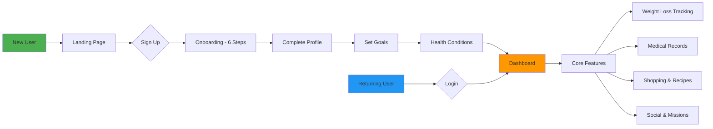

# Weight Loss Project Lab - Complete Platform Sitemap

> **Last Updated:** 2025-11-22
> **Status:** Living Document
> **Purpose:** Complete visual reference of all platform features and navigation flows

---

## Table of Contents

1. [Platform Overview](#platform-overview)
2. [User Journey Map](#user-journey-map)
3. [Main Navigation Structure](#main-navigation-structure)
4. [Core Features](#core-features)
5. [Medical System](#medical-system)
6. [Shopping & Meal Planning](#shopping--meal-planning)
7. [Gamification & Engagement](#gamification--engagement)
8. [Admin Portal](#admin-portal)
9. [Data Architecture](#data-architecture)
10. [Performance Considerations](#performance-considerations)

---

## Platform Overview

**Weight Loss Project Lab** is a comprehensive health and wellness platform combining:
- 🎯 Weight loss tracking with AI-powered meal analysis
- 🏥 Family medical records management
- 🛒 Smart grocery shopping with inventory tracking
- 📖 Recipe library with cooking sessions
- 🎮 Gamification with missions, groups, and rewards
- 👨‍⚕️ Healthcare provider and appointment management

**Technology Stack:**
- Next.js 14 (App Router)
- Firebase (Auth, Firestore, Storage)
- Google Gemini AI (meal analysis, health profiles, recipe generation)
- PWA (Progressive Web App)
- Tailwind CSS + shadcn/ui

---

## User Journey Map



---

## Main Navigation Structure

### Bottom Navigation (Mobile/Tablet)
Primary navigation bar fixed at bottom of screen:

| Icon | Label | Route | Description |
|------|-------|-------|-------------|
| 🏠 | Home | `/dashboard` | Main dashboard with quick actions |
| 👥 | Family | `/patients` | Patient/family member management |
| 🛒 | Shop | `/shopping` | Smart shopping list |
| 📦 | Kitchen | `/inventory` | Kitchen inventory & expiration tracking |
| 📖 | Recipes | `/recipes` | Recipe library & cooking sessions |
| 👤 | Profile | `/profile` | User profile, settings, and stats |

### Top Menu (Hamburger/Desktop)
Additional navigation accessed via hamburger menu:
- Progress Charts
- Weight History
- Medical Portal
- Appointments
- Medications
- Healthcare Providers
- Photo Gallery
- Missions & Groups
- Perks & Rewards
- AI Coaching
- Admin (if admin role)

---

## Core Features

### 1. Dashboard (`/dashboard`)
**Main hub after login**

#### Quick Actions
- 📷 Log Meal (photo + AI analysis)
- ⚖️ Log Weight (manual/photo/bluetooth)
- 🚶 Log Steps (manual/health sync)

#### Widgets
- Weight Trend Chart (7-day, 30-day, all-time)
- Today's Nutrition Summary (calories, macros)
- Step Counter (today's steps vs goal)
- XP Badge & Level
- Urgent Recommendations (AI-powered)
- Weight Reminder Modal (if due)

#### Data Sources
- `users/{uid}/profile` - Current weight fallback
- `weight-logs/` - Primary weight data
- `meal-logs/` - Nutrition data
- `step-logs/` - Activity data
- `users/{uid}/goals` - Target calculations

---

### 2. Patient/Family Management (`/patients`)

#### Patient List (`/patients`)
- View all patients (self + family members)
- Subscription limits (1 for single, 10 for family)
- Add new patient/family member
- Quick stats per patient

#### Patient Detail (`/patients/[patientId]`)
- Patient profile overview
- Weight logs (chart + table)
- Meal logs (photo grid)
- Step logs (activity chart)
- Health vitals summary
- Family collaboration panel

#### Add Patient (`/patients/new`)
- Patient type: Human or Pet
- Basic info (name, DOB, relationship)
- Photo upload
- Initial vitals (height, weight)

#### Family Collaboration (`/patients/[patientId]/family`)
- Invite family members (email/SMS)
- Permission matrix
  - View medical records
  - Edit medications
  - Schedule appointments
  - Log vitals
  - Upload documents
  - View sensitive info
- Driver license scanner (auto-fill info)
- Notification preferences per member

#### Family Member Logs
- `/api/patients/[patientId]/meal-logs` - Meal logging for family member
- `/api/patients/[patientId]/weight-logs` - Weight tracking
- `/api/patients/[patientId]/step-logs` - Activity tracking

---

### 3. Meal Logging

#### Log Meal (`/log-meal`)
**AI-Powered Food Analysis**

**Flow:**
1. Take/upload photo
2. AI analysis via Gemini Vision
3. USDA FoodData Central validation
4. Manual adjustments (optional)
5. Save as template (optional)
6. Add to meal logs

**Data Captured:**
- Food items with portions
- Total calories
- Macros (protein, carbs, fat, fiber)
- Meal type (breakfast/lunch/dinner/snack)
- Confidence score
- Photo URL + hash (deduplication)
- USDA verification status

**AI Analysis Components:**
- Food item recognition
- Portion size estimation
- Nutrition calculation
- Meal type suggestion
- Safety warnings (based on health profile)

**Templates:**
- Save frequently eaten meals
- Quick re-log from history
- Track usage count
- Last used timestamp

---

### 4. Weight Tracking

#### Log Weight (`/log-weight`)
**Three Input Methods:**

1. **Manual Entry**
   - Enter weight value
   - Select unit (lbs/kg)
   - Optional notes
   - Optional tags (morning, evening, post-workout)

2. **Photo-Verified**
   - Take photo of scale display
   - Manual entry required (AI validation future feature)
   - Photo stored for verification
   - Higher trust score

3. **Bluetooth Scale** (Future)
   - Auto-sync from smart scale
   - Device ID tracking
   - Highest trust score

#### Weight History (`/weight-history`)
- Table view with all entries
- Filter by date range
- Edit/delete historical entries
- Export data (CSV)

#### Weight Charts
- 7-day trend
- 30-day trend
- All-time progress
- Goal progress indicator
- Weekly average
- BMI calculation
- Projected completion date

---

### 5. Step Tracking

#### Log Steps (`/log-steps`)
**Data Sources:**

1. **Manual Entry** - User inputs step count
2. **Device Sensors** - PWA accelerometer/pedometer
3. **Apple Health** - HealthKit sync (requires native wrapper)
4. **Google Fit** - Google Fit API sync

#### Health App Integration
- Platform detection (iOS/Android/Web)
- Permission request flow
- Background sync
- Last sync timestamp
- Sync status indicators

#### Step Analytics
- Daily step chart
- Weekly average
- Calories burned estimate
- Distance traveled (km)
- Active minutes
- Floors climbed (if available)

---

### 6. Progress & Analytics (`/progress`)

#### Weight Analytics
- Weight loss rate (lbs/week)
- Total weight lost
- % to goal
- Trend direction (up/down/stable)
- Projected goal date

#### Nutrition Analytics
- Average daily calories (7/30/90 day)
- Macro distribution pie chart
- Calorie deficit/surplus
- Meal frequency analysis
- Top foods eaten

#### Activity Analytics
- Average steps per day
- Most active days/times
- Sedentary time
- Calorie burn from activity

#### Health Insights
- AI-generated recommendations
- Trend analysis
- Goal adjustment suggestions
- Plateau detection
- Health condition impact

---

## Medical System

### 7. Medical Portal (`/medical`)
**HIPAA-Compliant Medical Records Management**

#### Features
- Multi-patient support (family & pets)
- Document storage with OCR
- Appointment scheduling
- Provider database
- Medication tracking
- Health vitals logging

---

### 8. Appointments (`/appointments`)

#### Appointment List (`/appointments`)
- Upcoming appointments
- Past appointments
- Filter by patient
- Filter by provider type
- Calendar view option

#### New Appointment (`/appointments/new`)
- Select patient
- Select provider
- Date/time picker
- Duration
- Appointment type
  - Routine checkup
  - Follow-up
  - Specialist
  - Lab work
  - Imaging
  - Urgent care
  - Telehealth
- Reason/purpose
- Location
- Notes
- Driver assignment (if needed)

#### Appointment Detail (`/appointments/[appointmentId]`)
- Full appointment info
- Provider contact
- Location with map
- Driver status
- Check-in/complete
- Reschedule/cancel
- Visit summary
- Follow-up needed flag

#### AI Recommendations
**Automatic appointment suggestions based on:**
- Weight loss plateau (>3 weeks)
- Rapid weight loss (>2 lbs/week)
- Vital sign alerts (BP, blood sugar)
- Missed routine checkups
- Provider visit frequency rules
- Health condition triggers

**Recommendation Types:**
- Nutritionist
- Doctor checkup
- Specialist
- Mental health
- Routine screening
- Urgent care

**Urgency Levels:**
- 🔴 Urgent (schedule within 24-48 hours)
- 🟠 Soon (schedule within 1-2 weeks)
- 🟡 Normal (schedule within 1 month)
- 🟢 Routine (schedule at convenience)

---

### 9. Healthcare Providers (`/providers`)

#### Provider List (`/providers`)
- All providers across all patients
- Filter by type
  - Physician (PCP)
  - Specialist
  - Dentist
  - Veterinarian
  - Pharmacy
  - Lab
  - Imaging center
  - Urgent care
  - Hospital
  - Therapy
- Sort by proximity
- Mark as primary

#### Add Provider (`/providers/new`)
**Manual Entry:**
- Provider type
- Name
- Specialty
- Organization
- NPI (National Provider Identifier)
- Tax ID
- Address, city, state, zip
- Phone, fax, email, website
- Office hours
- Accepts insurance?
- Notes
- Patients served
- Recommended visit frequency

**Insurance Card Scanner:**
- Take photo of insurance card (front/back)
- OCR extraction
- Auto-fill provider info
- Manual verification/correction

#### Provider Detail (`/providers/[id]`)
- Full contact information
- Map with directions
- Patients this provider serves
- Upcoming appointments
- Past appointment history
- Average wait time
- Parking info
- Wheelchair accessible?
- Edit/delete provider

---

### 10. Medications (`/medications`)

#### Medication List (`/medications`)
- All medications across all patients
- Current medications
- Past medications
- Filter by patient
- Dosage schedule view

#### Medication Card Features
- Generic name + brand name
- Strength & dosage form
- Complete dosage instructions
- Prescribed for (condition)
- Patient name
- Prescription number
- Pharmacy info
- Quantity & refills
- Fill date
- Expiration date
- Drug warnings
- RxNorm RXCUI
- National Drug Code (NDC)

#### Medication Scanner
**Prescription Label OCR:**
- Take photo of prescription bottle
- Extract via Google Vision AI
- Classify drug type
- Lookup RxNorm database
- Auto-populate medication form
- Manual verification required

**Data Extracted:**
- Patient name
- Drug name (generic/brand)
- Strength
- Dosage form
- Complete instructions
- Quantity
- Refills
- Prescription number
- Fill date
- Expiration date
- Pharmacy name & phone
- Prescriber name

#### Medication Management Modal
- Add new medication
- Edit existing
- Mark as discontinued
- Medication reminders
- Drug interaction warnings
- Refill reminders

---

### 11. Medical Documents (`/medical` - Documents Section)

#### Document Categories
- 📋 Insurance Cards
- 🆔 Identification (Driver's license, passport)
- 🏥 Medical Records
- 🧪 Lab Results
- 💊 Prescriptions
- 📷 Imaging (X-rays, MRIs)
- 📄 Other

#### Document Upload
- Multi-photo support (up to 10 images per document)
- PDF upload support
- Category selection
- Name/description
- Associated patient
- Tags
- Notes
- OCR processing (automatic)

#### OCR Processing
**Status:** Pending → Processing → Completed/Failed

**Extracted Data (varies by category):**

**Insurance Card:**
- Provider name
- Member name
- Member ID
- Group number
- RxBin, RxPCN, RxGroup
- Policy number
- Effective date
- Expiration date

**Driver's License:**
- Full name
- Address
- Date of birth
- License number
- Expiration date
- State
- (Auto-fills family member form)

**Prescription:**
- (Same as medication scanner)

**Lab Results:**
- Test name
- Test date
- Result values
- Reference ranges
- Abnormal flags

#### Document Detail Modal
- Full-screen image viewer
- Image carousel (if multiple)
- Zoom/pan controls
- Extracted text display
- Metadata view
- Edit/delete
- Share with family
- Download original

---

### 12. Health Vitals (`/medical` - Vitals Section)

#### Vital Types Supported
1. **Blood Sugar** (Glucose)
   - Value in mg/dL or mmol/L
   - Measurement type (fasting, post-meal, random)
   - Tags (before meal, after meal, before medication)

2. **Blood Pressure**
   - Systolic / Diastolic (mmHg)
   - Pulse rate (bpm)
   - Position (sitting, standing, lying)
   - Arm (left, right)

3. **Pulse Oximeter**
   - SpO2 (oxygen saturation %)
   - Pulse rate (bpm)
   - Perfusion index (optional)

4. **Temperature**
   - Value in °F or °C
   - Method (oral, ear, forehead, rectal)

5. **Weight** (tracked separately in weight-logs)

#### Vital Log Form
- Select patient
- Vital type
- Value(s)
- Unit
- Recorded timestamp
- Method (manual, device, imported)
- Device ID (optional)
- Notes
- Tags

#### Vital Trend Charts
- 7-day, 30-day, 90-day views
- Normal range indicators
- Abnormal value highlighting
- Trend line
- Average calculation
- Export data

#### Vital Alerts
- Automatic detection of abnormal values
- Blood sugar: <70 (hypo) or >180 (hyper)
- Blood pressure: systolic >140 or <90, diastolic >90 or <60
- SpO2: <95%
- Temperature: >100.4°F (fever)
- Family notification (if enabled)
- AI recommendation trigger

---

## Shopping & Meal Planning

### 13. Shopping List (`/shopping`)

#### Smart Shopping Features
- Barcode scanner integration
- Recipe ingredient import
- AI smart suggestions
- Category organization
- Store selection
- Nutrition pre-review
- Family list sharing
- Purchase confirmation flow

#### Shopping Item Structure
- Product name
- Brand
- Quantity
- Unit
- Category (auto-detected or manual)
- Store
- Price (optional)
- Nutrition info
- Checked/purchased status
- Added from recipe (if applicable)
- Notes

#### Barcode Scanner
- Camera-based barcode scanning
- Product database lookup
- Nutrition info display
- Health compatibility check
- Add to list
- Alternative suggestions
- Product history tracking

#### Recipe Integration
- "Add all ingredients" button on recipes
- Automatic quantity calculation based on servings
- Check against kitchen inventory
- Only add missing items
- Group by category
- Store preference matching

#### Smart Suggestions
**AI-powered recommendations based on:**
- Frequently purchased items
- Health goals & restrictions
- Recent meals
- Seasonal items
- On-sale items (if store API available)
- Nutrition gaps

#### Category Confirmation Modal
- Auto-categorization via AI
- Manual category selection if uncertain
- Category options:
  - Produce
  - Meat & Seafood
  - Dairy & Eggs
  - Bakery
  - Pantry
  - Frozen
  - Beverages
  - Snacks
  - Health & Beauty
  - Household

#### Nutrition Review Modal
- Pre-purchase nutrition analysis
- Total calories if purchased
- Macro breakdown
- Health goal compatibility
- Warnings (high sodium, sugar, etc.)
- Alternative suggestions
- Approve/modify/remove

#### Store Picker
- Select preferred store
- Store-specific product matching
- Price comparison (future)
- Aisle location (future)
- Store hours
- Multi-store lists

#### Share List with Family
- Generate shareable link
- Real-time collaboration
- Who added each item
- Check-off notifications
- List version control

#### Purchase Confirmation
- Swipe to mark purchased
- Batch mark all checked items
- Move to inventory
- Add expiration date
- Receipt photo upload (future)
- Price tracking

#### Sequential Shopping Flow
- Category-by-category navigation
- Aisle optimization
- Progress indicator
- Skip categories
- Quick add while shopping
- Voice input (future)

---

### 14. Kitchen Inventory (`/inventory`)

#### Inventory Management
- Current items in kitchen
- Quantity tracking
- Expiration date monitoring
- Waste tracking
- Recipe matching

#### Expiration Calendar
- Calendar view of all expiring items
- Color-coded urgency
  - 🔴 Expired
  - 🟠 Expires in 1-3 days
  - 🟡 Expires in 4-7 days
  - 🟢 Expires in 8+ days
- Daily/weekly/monthly view
- Alert notifications

#### Expiration Scanner
- Scan "Best By" / "Use By" dates
- OCR date extraction
- Auto-assign to product
- Manual date picker fallback

#### Quantity Adjuster
- Quick +/- buttons
- Consume tracking
- Auto-remove when depleted
- Partial usage notes

#### Recipe Suggestions (Use Before Expires)
- Match inventory items to recipes
- Prioritize expiring ingredients
- Filter by what you have
- "Missing ingredients" indicator
- One-click add to shopping list

#### Waste Analytics Dashboard
- Total items wasted (count)
- Waste by category (pie chart)
- Estimated cost of waste (bar chart)
- Most wasted items
- Waste reduction tips
- Monthly/yearly trends
- Sustainability score

#### Analytics Metrics
- Average item lifespan
- Waste rate %
- Cost savings from waste reduction
- Freshness index
- Category breakdown
- Expiration trend chart

---

### 15. Recipe Library (`/recipes`)

#### Recipe Discovery (`/recipes`)
- Browse all recipes
- Search by name/ingredient
- Filter by:
  - Meal type (breakfast/lunch/dinner/snack)
  - Cuisine type
  - Prep time
  - Difficulty
  - Dietary restrictions
  - Calories per serving
  - Available ingredients
- Sort by:
  - Popularity
  - Rating
  - Newest
  - Prep time
  - Calories

#### Recipe Detail (`/recipes/[id]`)
**Full Recipe View:**
- Recipe name
- Hero image + photo carousel
- Prep time, cook time, total time
- Difficulty level
- Servings (adjustable)
- Nutrition per serving
  - Calories
  - Protein, carbs, fat, fiber
  - Other nutrients
- Ingredients list (scaled to servings)
- Step-by-step instructions
- Tips & notes
- Cuisine type
- Dietary tags (vegan, GF, keto, etc.)
- Rating & reviews (future)

**Recipe Actions:**
- ⏰ Start Cooking Session
- 📥 Add to Queue
- 🛒 Add Ingredients to Shopping List
- 📤 Share to Social Media
- ❤️ Favorite (future)
- 📝 Add Personal Notes (future)

#### Product Availability Matching
- Check kitchen inventory
- Highlight available ingredients (green)
- Highlight missing ingredients (orange)
- "X of Y ingredients available"
- Quick add missing items to shopping
- Alternative ingredient suggestions
- Store-specific product matching

#### Start Cooking Session (`/cooking/[sessionId]`)
**Interactive Cooking Mode:**

**Session Data:**
- Recipe ID
- User ID
- Serving size (scaled)
- Meal type
- Current step index
- Step timers
- Status (in-progress, paused, completed, abandoned)
- Started timestamp
- Completed timestamp

**UI Features:**
- Step-by-step navigation
- Large, readable text
- Prev/Next buttons
- Skip step option
- Ingredient checklist
- Step timers with notifications
- Pause/resume session
- Keep screen awake
- Hands-free voice control (future)

**Step Timers:**
- Auto-detect time durations in instructions ("Bake for 25 minutes")
- Visual countdown timer
- Audio/vibration alerts
- Multiple timers for complex recipes
- Background timer support

**Completion Flow:**
1. Mark session as completed
2. Auto-log meal
   - Pre-filled nutrition (scaled)
   - Meal type (from session)
   - Recipe name as title
   - Option to take photo
3. Add leftovers to inventory (future)
4. Rate recipe (future)

#### Recipe Queue (`/recipes` - Queue Tab)
- Saved recipes to cook later
- Planned meal date (optional)
- Meal type assignment
- Sort by planned date
- Remove from queue
- Quick start cooking
- Batch shopping list generation

#### Social Media Sharing
**Share Recipe:**
- Platform selection (Instagram, Facebook, Twitter, Pinterest)
- Auto-generated share image
- Recipe preview card
- Nutrition highlights
- Link back to app
- Hashtag suggestions

**Share Cooked Meal:**
- Photo from cooking session
- Recipe credit
- Personal notes
- Nutrition stats badge
- Before/after comparison

---

## Gamification & Engagement

### 16. Missions & Challenges (`/missions`)

#### Mission Types

**Daily Missions:**
- Log 3 meals today
- Hit step goal (10,000 steps)
- Stay under calorie goal
- Log weight
- Drink 8 glasses of water
- Cook a healthy recipe
- Complete meal prep

**Weekly Missions:**
- Lose 0.5-2 lbs
- Log all meals 5/7 days
- Try 3 new recipes
- Average 10k steps daily
- Hit macro targets 5/7 days
- Complete grocery shopping
- Meal prep for the week

**Monthly Goals:**
- Reach weight milestone
- 30-day streak
- Cook 20 recipes
- Waste reduction 20%
- Hit step goal 25/30 days
- Complete health checkup

**Seasonal Challenges:**
- Summer Shred (June-Aug)
- Holiday Healthy (Nov-Jan)
- Spring Reset (Mar-May)
- Fall Fitness (Sep-Nov)

#### Mission Rewards
- XP points
- Badge unlocks
- Perk eligibility
- Leaderboard ranking
- Virtual trophies
- Real-world perks (if partnered)

#### Mission Progress
- Progress bars
- Completion percentage
- Days remaining
- Current streak
- Best streak
- Total completed

---

### 17. Groups & Community (`/groups`)

#### Group Features
- Join/create weight loss groups
- Group challenges
- Shared leaderboard
- Group chat (future)
- Member directory
- Group goals
- Progress comparison

#### Group Types
- Public (anyone can join)
- Private (invite-only)
- Competitive (ranked)
- Support (no ranking)

#### Group Card Info
- Group name
- Member count
- Type (public/private)
- Current challenge
- Top performers
- Join/leave button

#### Group Leaderboard
- Weekly weight loss
- Total weight lost
- Steps logged
- Calories burned
- Meals logged
- XP earned
- Rank badges

---

### 18. Perks & Rewards (`/perks`)

#### Perk System
**Earn rewards for healthy behaviors**

**Perk Types:**
- Discounts (meal delivery, fitness apps)
- Free trials
- Premium features unlock
- Physical merchandise
- Gift cards
- Consultation credits

#### Eligibility Requirements
- Minimum XP level
- Streak requirements
- Goal achievement
- Mission completion
- Subscription tier

#### Eligibility Badge
- 🟢 Eligible - Ready to redeem
- 🟡 Almost There - Show progress
- 🔴 Not Eligible - Show requirements

#### Redemption Form
- Perk selection
- User verification
- Contact info collection
- Redemption code generation
- Email confirmation
- Redemption tracking

#### Perk Card Display
- Perk image
- Title
- Description
- Value
- Eligibility status
- Redeem button
- Terms & conditions

---

### 19. AI Coaching (`/coaching`)

#### AI Coach Features
- Personalized weight loss plan
- Weekly check-ins
- Progress analysis
- Habit recommendations
- Nutrition advice
- Exercise suggestions
- Motivational support
- Plateau troubleshooting

#### AI Coach Plan
**Gemini-powered coaching:**
- Analysis of user data
  - Weight trend
  - Calorie intake
  - Activity level
  - Meal patterns
  - Health conditions
- Custom recommendations
  - Calorie adjustments
  - Macro tweaks
  - Exercise plan
  - Meal timing
  - Hydration goals
  - Sleep targets
- Weekly action items
- Progress milestones
- Habit formation tips

#### Coaching Status Widget
- Current phase (e.g., "Steady Progress")
- Days on plan
- Adherence score
- Next check-in date
- Quick message to coach

#### Coaching Progress
- Weight vs. target chart
- Plan adherence %
- Completed action items
- Milestone badges
- Week-over-week comparison

#### Chat Interface (Future)
- Conversational AI coach
- Ask questions
- Get instant feedback
- Request plan adjustments
- Motivational messages
- Crisis support routing

---

## Admin Portal

### 20. Admin Dashboard (`/admin`)

**Access:** Requires admin role in Firestore user document

#### Admin Navigation
- 📊 Dashboard (overview)
- 👥 User Management
- 📖 Recipe Management
- 🛒 Product Database
- 📈 Analytics
- 🤖 AI Decisions Review
- 🛡️ Trust & Safety
- 🎯 Coaching Admin
- 🎁 Perks Management
- ⚙️ Settings

---

### 21. Admin Dashboard Overview (`/admin`)

#### Key Metrics Cards
- Total Users
- Active Users (7-day)
- Total Meals Logged
- Total Weight Logs
- Total Step Logs
- Total Recipes
- Total Products
- Pending AI Decisions

#### Recent Activity
- New user signups
- Recent meals logged
- Recipe creations
- Product scans
- Admin actions

#### System Health
- API usage
- Error rate
- Cache hit rate
- Database performance
- Storage usage

---

### 22. User Management (`/admin/users`)

#### User List
- All registered users
- Search by email/name
- Filter by:
  - Subscription plan
  - Admin status
  - Onboarding status
  - Last active date
  - Account created date
- Sort by various fields

#### User Details (Click to expand)
- User ID (Firebase UID)
- Email
- Name
- Subscription plan
- Account created
- Last active
- Onboarding completed?
- Current onboarding step
- Total patients
- Admin status
- Quick actions:
  - Grant/revoke admin
  - View AI health profile
  - View health vitals
  - Impersonate user (dev only)
  - Delete account

#### User Stats
- Weight logs count
- Meal logs count
- Step logs count
- Recipes cooked
- XP earned
- Missions completed

---

### 23. Recipe Management (`/admin/recipes`)

#### Recipe CMS
- All recipes in database
- Search/filter
- Edit existing recipes
- Create new recipes
- Delete recipes
- Bulk import
- Export recipes

#### Recipe Editor (`/admin/recipes/[id]/edit`)
**Full CRUD Interface:**

**Basic Info:**
- Recipe name
- Description
- Cuisine type
- Meal type
- Difficulty
- Prep time
- Cook time
- Servings

**Ingredients:**
- Dynamic list (add/remove)
- Ingredient name
- Quantity
- Unit
- Optional/substitutions
- Ingredient notes

**Instructions:**
- Step-by-step list
- Drag-to-reorder
- Rich text formatting
- Timer detection
- Step images (optional)

**Nutrition:**
- Calories per serving
- Protein
- Carbs
- Fat
- Fiber
- Sodium
- Sugar
- Other nutrients

**Media:**
- Hero image upload
- Additional photos (up to 10)
- Video URL (future)
- Image carousel order

**Tags & Metadata:**
- Dietary tags (vegan, GF, keto, paleo, etc.)
- Allergen warnings
- Cuisine tags
- Course (appetizer, main, dessert, etc.)
- Holiday tags
- Seasonal tags
- Difficulty level
- Popularity score
- Rating (future)

**SEO:**
- Meta title
- Meta description
- Keywords
- URL slug

#### AI Recipe Generator
**Gemini-powered recipe creation:**

**Inputs:**
- Recipe concept/theme
- Cuisine type
- Dietary restrictions
- Target calories
- Preferred ingredients
- Ingredients to avoid
- Servings
- Time constraint

**Outputs:**
- Complete recipe with all fields
- AI-generated description
- Ingredients with quantities
- Step-by-step instructions
- Estimated nutrition
- Suggested tags
- Recipe name variations

**Human Review:**
- Admin reviews AI output
- Edit any field
- Approve for publication
- Reject with feedback
- Save as draft

#### Recipe Import Modal
**Bulk Import Options:**

1. **URL Import** (recipe website scraping)
   - Enter recipe URL
   - Parse HTML
   - Extract structured data
   - Map to recipe schema
   - Manual verification

2. **JSON Import** (structured data)
   - Upload JSON file
   - Validate schema
   - Batch import
   - Error handling

3. **CSV Import** (spreadsheet)
   - Upload CSV
   - Map columns
   - Batch create
   - Preview before import

#### Recipe Media Upload
- Drag-and-drop interface
- Multi-file upload
- Image cropping tool
- Automatic optimization
- WebP conversion
- Thumbnail generation
- Alt text for accessibility
- Caption field

---

### 24. Product Database (`/admin/products`)

#### Product List
- All scanned products
- Search by barcode/name
- Filter by:
  - Category
  - Brand
  - Store
  - Scan count
  - Last scanned
  - Has nutrition data?

#### Product Detail (`/admin/products/[barcode]`)
- Product name
- Brand
- Barcode (UPC/EAN)
- Category
- Subcategory
- Serving size
- Nutrition facts
  - Calories
  - Macros
  - Micronutrients
  - Allergens
- Product images
- Scan count
- First scanned date
- Last scanned date
- User who added
- Edit/delete

#### Barcode Editor (`/admin/barcodes/[barcode]/edit`)
- Edit all product fields
- Upload product images
- Correct nutrition data
- Add missing info
- Merge duplicates
- Retire old barcodes

#### Product Analytics
- Top scanned products
- Scan timeline chart
- Store breakdown (pie chart)
- Category distribution
- Context breakdown (shopping, inventory, meal logging)
- User scan patterns

---

### 25. Analytics Dashboards (`/admin/analytics`)

#### User Analytics
**Charts & Metrics:**
- New users over time (line chart)
- Daily active users (DAU)
- Weekly active users (WAU)
- Monthly active users (MAU)
- User retention (cohort analysis)
- Churn rate
- Average session duration
- Pages per session
- Top pages visited
- User demographic breakdown
- Subscription plan distribution

**Admin Daily Calories Chart:**
- Average calories logged per day
- All users aggregated
- 30-day rolling average
- Goal comparison
- Outlier detection

**Admin Step Logs Chart:**
- Total steps logged across all users
- Daily average
- Peak activity times
- Device source breakdown
- Health app sync rate

**Admin Weight Logs Chart:**
- Total weight logs count
- Average weight change
- Success rate (users hitting goals)
- Data source breakdown (manual, photo, bluetooth)

#### ML Analytics (`/admin/ml-analytics`)
**AI Model Performance:**

**Meal Analysis Model:**
- Total analyses run
- Average confidence score
- Confidence distribution
- USDA match rate
- Manual override rate
- Low confidence alerts

**Health Profile Model:**
- Profiles generated
- Average confidence
- Admin approval rate
- Rejection reasons
- Model version tracking

**Recipe Generation Model:**
- Recipes generated
- Acceptance rate
- Edit frequency
- Popular themes
- Failed generations

**OCR Performance:**
- Documents processed
- Success rate
- Processing time
- Accuracy by document type
- Manual correction rate

#### API Usage Timeline (`/admin/api-usage`)
- Gemini API calls over time
- API cost tracking
- Calls by endpoint
- Average response time
- Error rate
- Rate limit monitoring
- Cost per feature
- Budget alerts

#### Cache Performance (`/admin/analytics` - Cache Tab)
**Cache Freshness Chart:**
- Cache hit rate %
- Cache miss rate %
- Stale data rate %
- Average cache age
- Cache size
- Eviction rate
- Popular cached queries
- Cache optimization suggestions

---

### 26. AI Decisions Review (`/admin/ai-decisions`)

**Human-in-the-loop AI governance**

#### Decision Queue
- Unreviewed decisions (priority queue)
- Filter by:
  - Decision type
  - Confidence score
  - User
  - Date range
  - Review status

#### Decision Types

**1. Meal Analysis Decisions**
- User photo
- AI-detected food items
- Nutrition estimates
- Confidence score
- USDA validation results
- User's manual adjustments (if any)

**Admin Actions:**
- ✅ Approve (trust AI)
- ❌ Reject (bad analysis)
- ✏️ Modify (correct values)
- 🚫 Flag User (suspicious)

**2. Health Profile Decisions**
- User health conditions
- AI-generated restrictions
- Calorie adjustments
- Critical warnings
- Confidence score

**Admin Actions:**
- ✅ Approve
- ❌ Reject
- ✏️ Modify restrictions
- 💬 Add notes

**3. Meal Safety Decisions**
- Meal nutrition
- User health profile
- Safety warnings generated
- Severity level
- Confidence score

**Admin Actions:**
- ✅ Approve (safe)
- ⚠️ Add warning
- 🚫 Block meal
- 📞 Contact user

#### Review Workflow
1. Admin sees decision card
2. Reviews AI reasoning
3. Checks user context
4. Makes decision
5. Adds optional notes
6. Submits review
7. User notified (if needed)
8. Decision logged for model training

#### Review Metrics
- Avg review time
- Approval rate by type
- Reversal rate (admin disagreed with AI)
- Top rejection reasons
- Reviewer leaderboard

---

### 27. Trust & Safety (`/admin/trust-safety`)

**Content moderation & user safety**

#### Case Types
- 🚩 Flagged content
- 🤖 AI safety alerts
- 👤 User reports
- 🔍 Suspicious patterns
- 💊 Medication concerns
- 🩺 Health risk alerts

#### Case List
- All open cases
- Filter by type, severity, date
- Sort by priority
- Assign to admin
- Bulk actions

#### Case Card
- Case ID
- User info
- Type & severity
- Description
- Evidence (photos, logs)
- AI risk score
- Created date
- Assigned admin
- Status (open, investigating, resolved)

#### Risk Score Display
**AI-calculated risk level:**
- 🟢 Low (0-30)
- 🟡 Medium (31-60)
- 🟠 High (61-85)
- 🔴 Critical (86-100)

**Risk Factors:**
- Eating disorder patterns
- Extreme calorie restriction
- Rapid weight loss
- Medication interactions
- Vital sign alerts
- Self-harm indicators
- Underage user (COPPA)

#### Action Panel
**Admin Actions:**
- 👁️ Monitor (watch, no action)
- 💬 Message User (wellness check)
- ⚠️ Warning (TOS violation)
- ⏸️ Suspend Account (temp ban)
- 🚫 Ban Account (permanent)
- 📞 Emergency Contact (crisis intervention)
- ✅ Resolve Case (false alarm)
- 📝 Add Notes

**External Actions:**
- Export case data
- Contact emergency services
- Legal hold
- Report to authorities (if required)

#### Escalation Rules
- Auto-escalate critical cases
- Notify multiple admins
- Time-based SLAs
- After-hours on-call
- Crisis hotline integration

---

### 28. Coaching Admin (`/admin/coaching`)

#### AI Coach Configuration
- Model selection
- Prompt templates
- Response tone settings
- Safety guardrails
- Escalation triggers

#### Coach Analytics
- Total coaching sessions
- User engagement rate
- Average satisfaction score
- Top questions asked
- Intervention rate
- Success metrics (goal achievement)

#### Coaching Overrides
- Review flagged conversations
- Human takeover mode
- Canned responses library
- Coach performance tuning

---

### 29. Perks Management (`/admin/perks`)

#### Perk CMS
- Create/edit perks
- Set eligibility rules
- Configure redemption limits
- Upload perk images
- Write descriptions
- Set expiration dates
- Track redemption codes

#### Perk Analytics
- Redemption rate
- Popular perks
- User engagement
- Partner performance
- Revenue impact

---

### 30. Admin Settings (`/admin/settings`)

#### System Configuration
- Feature flags (enable/disable features)
- API keys management
- Rate limits
- Cache settings
- Notification settings
- Email templates
- SMS templates
- Push notification config

#### Model Configuration
- Gemini API settings
- Model versions
- Confidence thresholds
- Fallback behavior
- A/B test variants

#### Security Settings
- Admin access control
- IP allowlist
- Session timeout
- 2FA enforcement
- Audit log retention
- Data retention policies

---

## Data Architecture

### Firestore Collections

```
users/
  {uid}/
    profile (UserProfile)
    goals (UserGoals)
    preferences (UserPreferences)
    subscription (UserSubscription)
    biometricAuth (BiometricAuthData)
    aiHealthProfile (AIHealthProfile)
    healthSync (HealthSyncPreferences)

patients/
  {patientId} (PatientProfile)

family-members/
  {userId}/
    members/
      {memberId} (FamilyMember)

family-invitations/
  {inviteId} (FamilyInvitation)

weight-logs/
  {logId} (WeightLog)
  ├─ userId (indexed)
  ├─ patientId (indexed)
  └─ loggedAt (indexed)

meal-logs/
  {logId} (MealLog)
  ├─ userId (indexed)
  ├─ patientId (indexed)
  ├─ mealType (indexed)
  └─ loggedAt (indexed)

step-logs/
  {logId} (StepLog)
  ├─ userId (indexed)
  ├─ patientId (indexed)
  └─ date (indexed)

vital-signs/
  {vitalId} (VitalSign)
  ├─ patientId (indexed)
  ├─ type (indexed)
  └─ recordedAt (indexed)

providers/
  {providerId} (Provider)
  └─ userId (indexed)

appointments/
  {appointmentId} (Appointment)
  ├─ userId (indexed)
  ├─ patientId (indexed)
  ├─ providerId (indexed)
  ├─ dateTime (indexed)
  └─ status (indexed)

appointment-recommendations/
  {recommendationId} (AppointmentRecommendation)
  ├─ userId (indexed)
  ├─ patientId (indexed)
  ├─ status (indexed)
  └─ severity (indexed)

documents/
  {documentId} (PatientDocument)
  ├─ userId (indexed)
  ├─ patientId (indexed)
  ├─ category (indexed)
  └─ uploadedAt (indexed)

recipes/
  {recipeId} (Recipe)
  ├─ name
  ├─ cuisine
  ├─ mealType
  ├─ difficulty
  ├─ prepTime
  ├─ ingredients[]
  ├─ instructions[]
  ├─ nutrition
  └─ media[]

cooking-sessions/
  {sessionId} (CookingSession)
  ├─ userId (indexed)
  ├─ recipeId (indexed)
  ├─ status (indexed)
  └─ startedAt (indexed)

recipe-queue/
  {queueId} (QueuedRecipe)
  ├─ userId (indexed)
  └─ recipeId (indexed)

shopping-lists/
  {userId}/
    items/
      {itemId} (ShoppingItem)

inventory-items/
  {userId}/
    items/
      {itemId} (InventoryItem)
      └─ expirationDate (indexed)

products/
  {barcode} (Product)
  └─ scanCount (indexed)

product-scans/
  {scanId} (ProductScan)
  ├─ userId (indexed)
  ├─ barcode (indexed)
  └─ scannedAt (indexed)

missions/
  {missionId} (Mission)

user-missions/
  {userId}/
    missions/
      {missionId} (UserMissionProgress)

groups/
  {groupId} (Group)

group-members/
  {groupId}/
    members/
      {userId} (GroupMember)

perks/
  {perkId} (Perk)

perk-redemptions/
  {redemptionId} (PerkRedemption)
  └─ userId (indexed)

ai-decisions/
  {decisionId} (AIDecision)
  ├─ type (indexed)
  ├─ reviewStatus (indexed)
  └─ createdAt (indexed)

ai-recommendations/
  {recommendationId} (AIRecommendation)
  ├─ userId (indexed)
  └─ acknowledged (indexed)

meal-templates/
  {templateId} (MealTemplate)
  └─ userId (indexed)

notifications/
  {userId}/
    notifications/
      {notificationId} (Notification)

api-usage/
  {logId} (APIUsageLog)
  └─ timestamp (indexed)

admin-audit-logs/
  {logId} (AdminAction)
  ├─ adminId (indexed)
  ├─ action (indexed)
  └─ timestamp (indexed)
```

### Firebase Storage Structure

```
users/
  {uid}/
    profile-photo.jpg
    meal-photos/
      {mealId}/
        main.jpg
        additional-1.jpg
        additional-2.jpg
    weight-photos/
      {logId}.jpg

patients/
  {patientId}/
    profile-photo.jpg
    documents/
      {documentId}/
        front.jpg
        back.jpg

recipes/
  {recipeId}/
    hero.jpg
    step-1.jpg
    step-2.jpg

products/
  {barcode}/
    product-image.jpg

social-shares/
  {shareId}/
    generated-image.jpg
```

---

## Performance Considerations

### Current Performance Bottlenecks

#### 1. Dashboard Data Fetching
**Problem:** Multiple sequential Firestore queries on dashboard load

**Current Flow:**
```
Dashboard renders
  → Fetch user profile
  → Fetch user goals
  → Fetch today's meal logs
  → Fetch today's step logs
  → Fetch recent weight logs
  → Fetch AI recommendations
  → Fetch urgent appointment recommendations
  → Calculate nutrition summary
  → Calculate weight trend
  → Render
```

**Optimization Strategies:**
- ✅ Use React Query for parallel queries
- ✅ Cache dashboard data (5-minute TTL)
- 🔄 Implement dashboard summary document (denormalized)
- 🔄 Use Firestore composite queries
- 🔄 Preload dashboard data during auth
- 🔄 Service worker cache API responses

**Estimated Improvement:** 60% faster load (3s → 1.2s)

---

#### 2. Recipe List with Product Matching
**Problem:** For each recipe, checking inventory for ingredient matches

**Current Flow:**
```
Fetch all recipes (100+)
  → For each recipe:
    → Fetch user inventory
    → Match ingredients
    → Calculate availability %
  → Render
```

**Optimization Strategies:**
- ✅ Paginate recipes (20 per page)
- 🔄 Lazy load product matching (on scroll)
- 🔄 Background worker for matching
- 🔄 Cache inventory snapshot (10-minute TTL)
- 🔄 Debounce match calculations
- 🔄 Pre-compute common matches server-side

**Estimated Improvement:** 75% faster (4s → 1s)

---

#### 3. Weight History Chart
**Problem:** Fetching all weight logs for chart rendering

**Current Flow:**
```
Weight History Page loads
  → Fetch ALL weight logs (could be 365+)
  → Filter by date range client-side
  → Sort
  → Render chart
```

**Optimization Strategies:**
- ✅ Query only date range needed
- ✅ Use Firestore orderBy + limit
- 🔄 Paginate historical data
- 🔄 Cache chart data points
- 🔄 Virtual scrolling for table view
- 🔄 Lazy load chart library

**Estimated Improvement:** 80% faster (2.5s → 0.5s)

---

#### 4. Meal Photo Upload & Analysis
**Problem:** Slow upload → AI analysis → USDA validation flow

**Current Flow:**
```
User takes photo (2-5 MB)
  → Upload to Firebase Storage (3-8s)
  → Get download URL
  → Send to Gemini API (4-7s)
  → Parse response
  → For each food item:
    → Query USDA API (0.5-1s each)
  → Merge results
  → Display
Total: 10-20 seconds
```

**Optimization Strategies:**
- ✅ Image compression before upload (reduce to 500KB)
- ✅ WebP format conversion
- 🔄 Optimistic UI (show loading state immediately)
- 🔄 Progressive image upload (show preview while uploading)
- 🔄 Parallel USDA queries (Promise.all)
- 🔄 USDA response caching (common foods)
- 🔄 Edge function for AI analysis (reduce latency)
- 🔄 Background processing option

**Estimated Improvement:** 50% faster (15s → 7.5s)

---

#### 5. Shopping List Barcode Scanning
**Problem:** Camera feed lag + product lookup delay

**Current Flow:**
```
Open camera
  → Continuous barcode detection
  → On detection:
    → Query Firestore products/{barcode}
    → If not found:
      → Query external API (Open Food Facts)
    → Display result
```

**Optimization Strategies:**
- ✅ Reduce camera resolution (720p vs 1080p)
- ✅ Throttle barcode detection (every 300ms)
- 🔄 Preload common products (cache)
- 🔄 Offline barcode database (IndexedDB)
- 🔄 Debounce duplicate scans (1s)
- 🔄 Background product sync

**Estimated Improvement:** 40% faster (2s → 1.2s)

---

### Recommended Performance Improvements

#### High Priority (Immediate Impact)

1. **Implement React Query for Data Fetching**
   - Replace manual useEffect + useState patterns
   - Automatic caching, deduplication, refetching
   - Optimistic updates
   - Background synchronization

2. **Add Service Worker Caching**
   - Cache static assets (JS, CSS, images)
   - Cache API responses (stale-while-revalidate)
   - Offline fallback pages
   - Background sync for logs

3. **Image Optimization Pipeline**
   - Automatic compression on upload
   - WebP conversion
   - Multiple sizes (thumbnail, medium, full)
   - Lazy loading with blur placeholders

4. **Database Query Optimization**
   - Add composite indexes for common queries
   - Use `limit()` on all list queries
   - Implement cursor-based pagination
   - Denormalize frequently accessed data

5. **Code Splitting**
   - Route-based splitting (already have with Next.js)
   - Component lazy loading (React.lazy)
   - Dynamic imports for heavy libraries (charts, camera)

#### Medium Priority (User Experience)

6. **Preloading & Prefetching**
   - Prefetch likely next pages
   - Preload critical resources
   - DNS prefetch for external APIs

7. **Virtual Scrolling**
   - Recipe list
   - Weight history table
   - Product search results
   - Meal log history

8. **Optimistic UI Updates**
   - Instant feedback on actions
   - Show success before server confirmation
   - Roll back on error
   - Loading skeletons

9. **Background Processing**
   - Web Workers for heavy calculations
   - Service Worker for sync
   - IndexedDB for offline storage

10. **Bundle Size Reduction**
    - Remove unused dependencies
    - Replace heavy libraries (moment.js → date-fns)
    - Tree shaking verification
    - Analyze bundle with webpack-bundle-analyzer

#### Low Priority (Future Optimization)

11. **CDN Integration**
    - Serve images from CDN
    - Edge caching
    - Geographic distribution

12. **Database Sharding**
    - Separate hot/cold data
    - Archive old logs
    - Read replicas for analytics

13. **AI Response Streaming**
    - Stream Gemini responses (show partial results)
    - Progressive USDA validation
    - Real-time UI updates

14. **Advanced Caching Strategies**
    - Redis for session data
    - Memcached for hot queries
    - Edge caching (Cloudflare Workers)

---

### Performance Metrics Goals

| Metric | Current | Target | Strategy |
|--------|---------|--------|----------|
| Dashboard Load Time | 3.2s | <1.5s | React Query + denormalized data |
| Meal Photo Analysis | 15s | <8s | Image compression + parallel queries |
| Recipe List Load | 4.1s | <1s | Pagination + lazy matching |
| Weight Chart Render | 2.5s | <0.5s | Query optimization + caching |
| Barcode Scan Response | 2.0s | <1s | Offline DB + preloading |
| First Contentful Paint | 1.8s | <1s | Code splitting + preload |
| Time to Interactive | 4.5s | <2.5s | Service worker + lazy loading |
| Lighthouse Score | 72 | >90 | All optimizations combined |

---

### Data Flow Optimization Recommendations

#### 1. Denormalize Dashboard Data
**Current:** 7 separate queries
**Proposed:** 1 query to `users/{uid}/dashboard-summary`

**Summary Document Structure:**
```typescript
{
  lastUpdated: Date,
  todayNutrition: {
    calories: number,
    protein: number,
    carbs: number,
    fat: number,
    mealsLogged: number
  },
  todayActivity: {
    steps: number,
    caloriesBurned: number
  },
  weightTrend: {
    current: number,
    change7d: number,
    change30d: number,
    trend: 'up' | 'down' | 'stable'
  },
  urgentRecommendations: AppointmentRecommendation[],
  nextAppointment: Appointment | null
}
```

**Update Triggers:**
- Cloud Function on meal log creation → update todayNutrition
- Cloud Function on weight log → update weightTrend
- Cloud Function on step log → update todayActivity
- Scheduled function (hourly) → recalculate recommendations

**Benefit:** 85% reduction in dashboard load queries

---

#### 2. Client-Side Caching Strategy

**Cache Layers:**

**L1: In-Memory (React Query)**
- TTL: 5 minutes
- Data: Dashboard, profile, goals
- Invalidation: On mutation

**L2: IndexedDB (Local Storage)**
- TTL: 1 hour
- Data: Recipes, products, meal templates
- Invalidation: On app update

**L3: Service Worker Cache**
- TTL: 24 hours
- Data: Static assets, images
- Invalidation: On deploy

**L4: CDN Cache**
- TTL: 7 days
- Data: Recipe images, product images
- Invalidation: Manual purge

---

#### 3. Batch Operations

**Current:** Individual Firestore writes
**Proposed:** Batched writes

**Example: Shopping List → Inventory Flow**
```javascript
// Current (slow)
purchasedItems.forEach(item => {
  await addToInventory(item)
  await removeFromShoppingList(item)
})

// Optimized (fast)
const batch = firestore.batch()
purchasedItems.forEach(item => {
  batch.set(inventoryRef(item.id), item)
  batch.delete(shoppingListRef(item.id))
})
await batch.commit()
```

**Applies to:**
- Bulk purchase confirmation
- Recipe ingredient import
- Family member invitation acceptance
- Multi-patient data export

---

#### 4. Lazy Loading Strategy

**Component Lazy Loading:**
```javascript
// Heavy chart libraries
const WeightChart = lazy(() => import('./WeightChart'))
const MacroPieChart = lazy(() => import('./MacroPieChart'))

// Camera components
const BarcodeScanner = lazy(() => import('./BarcodeScanner'))
const MealPhotoCapture = lazy(() => import('./MealPhotoCapture'))

// Admin panels
const AdminDashboard = lazy(() => import('./AdminDashboard'))
```

**Route-based Code Splitting:** (Already implemented with Next.js App Router)

**Data Lazy Loading:**
- Recipe details (load on expand)
- Historical weight logs (load on scroll)
- Meal photos (load on gallery open)
- Document OCR text (load on detail view)

---

#### 5. Real-time vs. Snapshot Queries

**Use Real-time (onSnapshot) For:**
- Shopping list (collaborative)
- Active cooking session
- Family member updates
- Urgent notifications

**Use Snapshot (get) For:**
- Historical data (weight logs)
- Recipe library
- Product database
- Analytics dashboards

**Benefit:** Reduce unnecessary Firestore reads by 40%

---

## Summary

**Total Pages:** 52
**Total Features:** 150+
**Core Systems:** 7
- Weight Loss Tracking
- Medical Records
- Shopping & Inventory
- Recipe Management
- Gamification
- Admin Portal
- AI Systems

**Key Technologies:**
- Next.js 14 (App Router)
- Firebase (Auth, Firestore, Storage, Functions)
- Google Gemini AI
- Progressive Web App (PWA)
- Tailwind CSS + shadcn/ui
- Recharts (data visualization)
- Web Bluetooth API (future)

**Performance Targets:**
- Dashboard load: <1.5s
- Meal analysis: <8s
- Recipe list: <1s
- Lighthouse score: >90

---

**Next Steps:**
1. Review this sitemap for accuracy
2. Identify missing features
3. Prioritize performance optimizations
4. Create Figma wireframes based on this structure
5. Document API endpoints
6. Create data flow diagrams (next document)

---

*This is a living document. Update as features are added/removed.*
