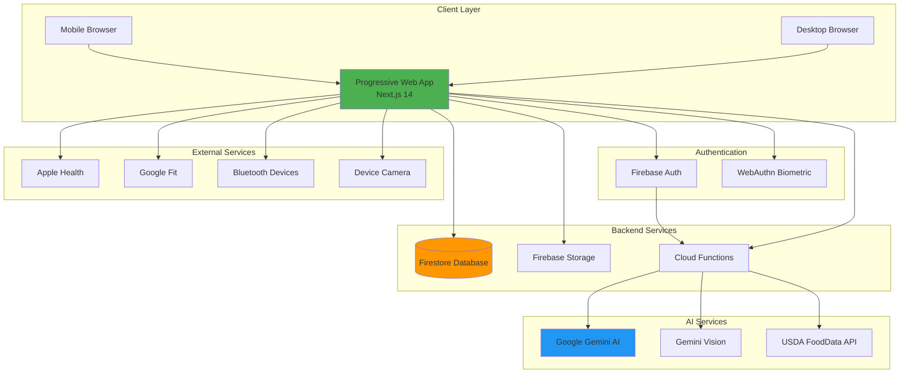
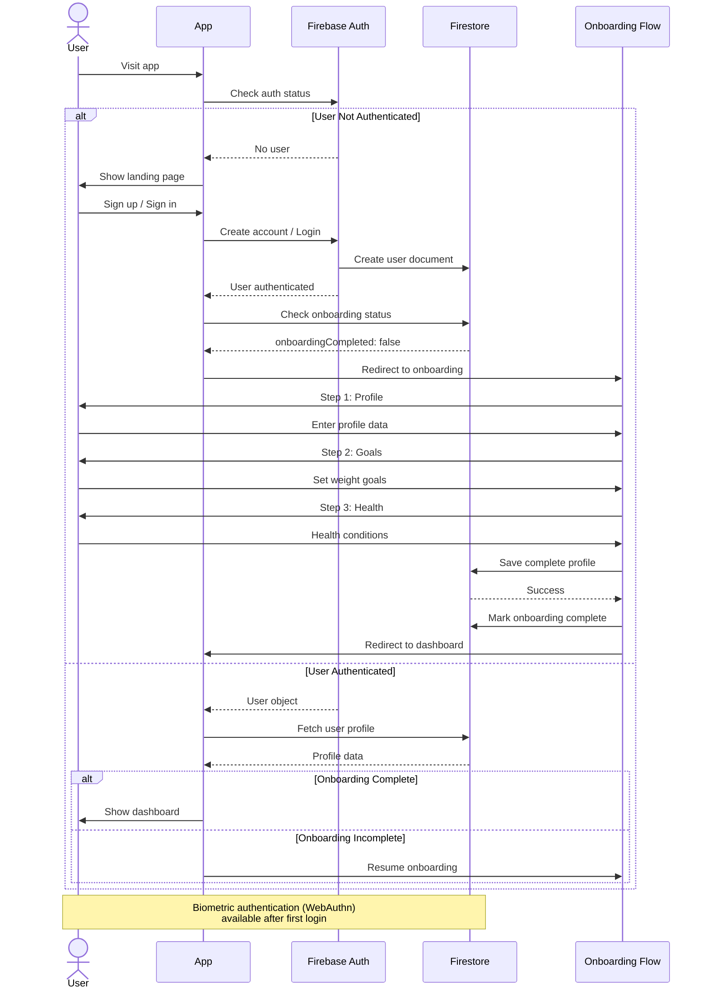
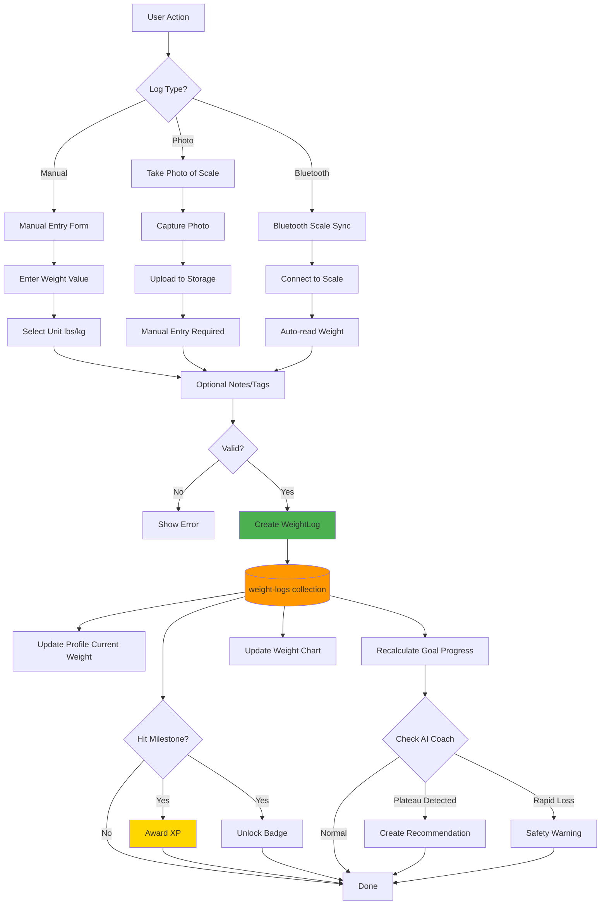
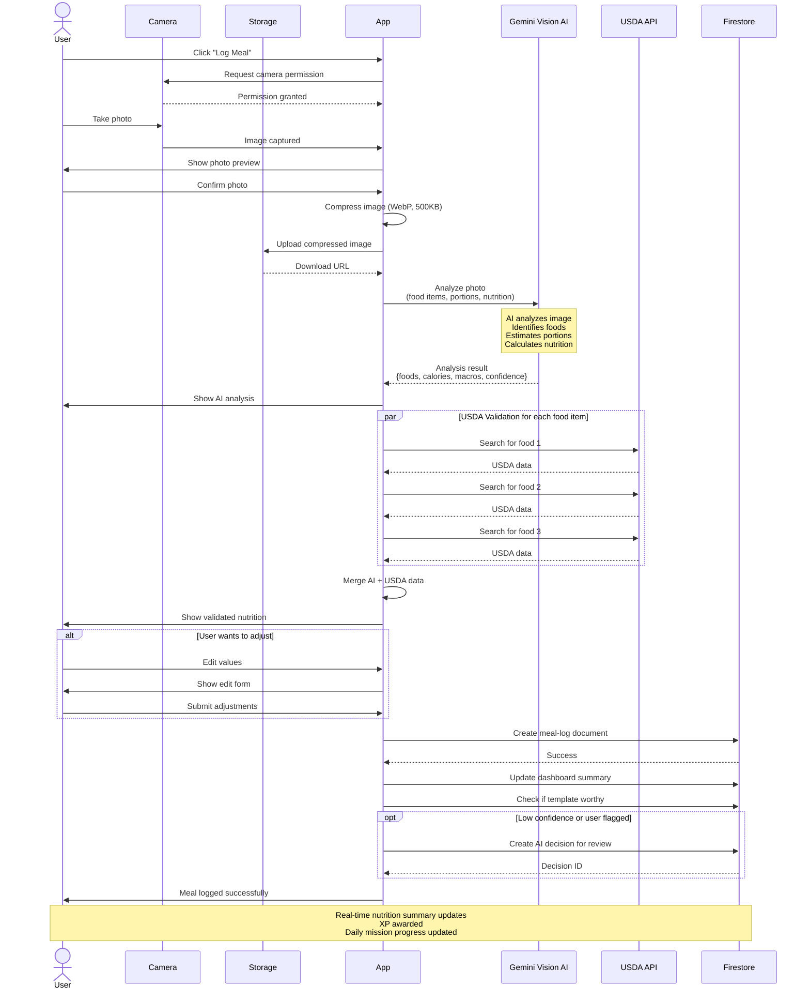
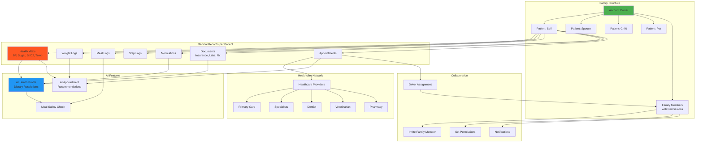
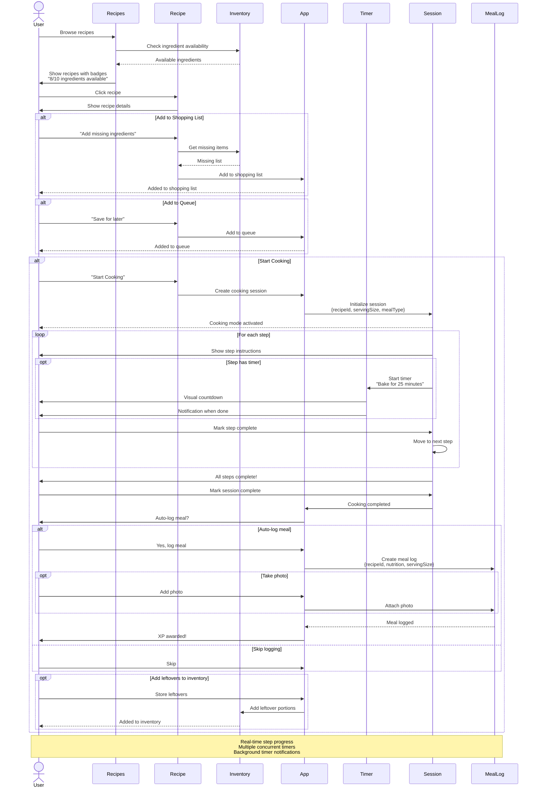
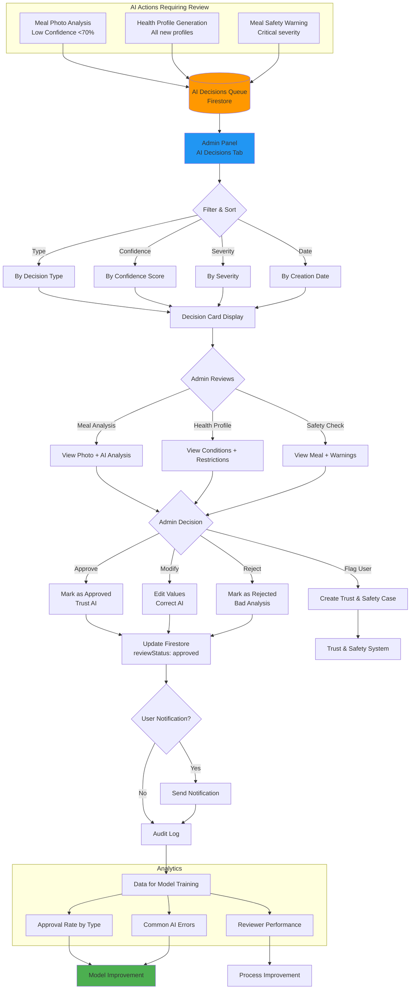
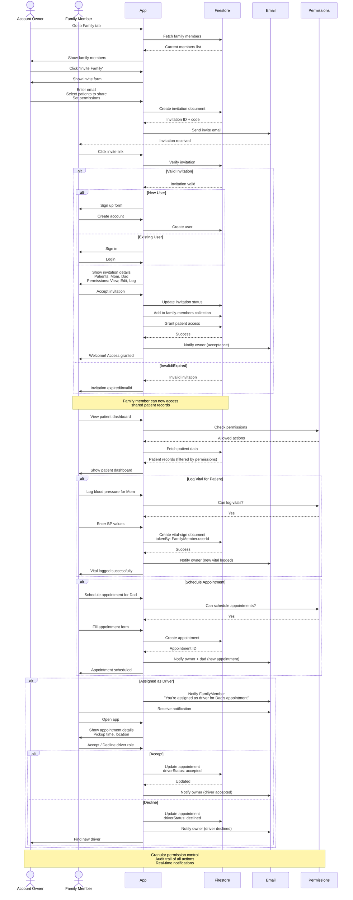

# Weight Loss Project Lab - System Flow Diagrams

> **Visual diagrams for understanding data flows and system architecture**
> These Mermaid diagrams can be viewed in GitHub, VS Code, or exported as images for Figma

---

## Table of Contents

1. [Overall Platform Architecture](#overall-platform-architecture)
2. [User Authentication Flow](#user-authentication-flow)
3. [Weight Tracking Data Flow](#weight-tracking-data-flow)
4. [Meal Logging Flow](#meal-logging-flow)
5. [Medical Records System](#medical-records-system)
6. [Shopping to Inventory Flow](#shopping-to-inventory-flow)
7. [Recipe to Cooking Flow](#recipe-to-cooking-flow)
8. [AI Decision Review Workflow](#ai-decision-review-workflow)
9. [Family Collaboration Flow](#family-collaboration-flow)
10. [Performance Optimization Flow](#performance-optimization-flow)

---

## Overall Platform Architecture



---

## User Authentication Flow



---

## Weight Tracking Data Flow



---

## Meal Logging Flow



---

## Medical Records System



---

## Shopping to Inventory Flow

```mermaid
graph LR
    subgraph "Input Sources"
        Manual[Manual Add]
        Barcode[Barcode Scan]
        Recipe[Recipe Import]
    end

    subgraph "Shopping List"
        SL[Shopping List Items]
        Category[Categorized]
        Store[Store Selected]
        Nutrition[Nutrition Preview]
    end

    Manual --> SL
    Barcode --> ProductDB[(Product Database)]
    ProductDB --> SL
    Recipe --> Ingredients[Extract Ingredients]
    Ingredients --> CheckInv{In Inventory?}
    CheckInv -->|No| SL
    CheckInv -->|Yes| Skip[Skip Item]

    SL --> Category
    Category --> Store
    Store --> Nutrition

    Nutrition --> HealthCheck{Health Compatible?}
    HealthCheck -->|Warning| Alert[Show Warning]
    HealthCheck -->|OK| Ready[Ready to Shop]

    Alert --> UserDecide{User Decision}
    UserDecide -->|Remove| RemoveItem[Remove from List]
    UserDecide -->|Keep| Ready

    Ready --> Shopping[Go Shopping]
    Shopping --> Purchase{Item Purchased?}

    Purchase -->|Yes| Inventory[(Kitchen Inventory)]
    Purchase -->|No| StillNeeded[Remains on List]

    Inventory --> Expiration[Set Expiration Date]
    Expiration --> Calendar[Expiration Calendar]

    Calendar --> Monitor{Days to Expire}
    Monitor -->|7 days| Notification[Notification]
    Monitor -->|3 days| UrgentNotif[Urgent Notification]
    Monitor -->|Expired| Waste[Track Waste]

    Monitor --> RecipeSuggest[Recipe Suggestions<br/>Use Before Expires]

    Inventory --> Consume{Consumed?}
    Consume -->|Yes| Remove[Remove from Inventory]
    Consume -->|Partial| Adjust[Adjust Quantity]
    Consume -->|Expired| Waste

    Waste --> Analytics[Waste Analytics]
    Analytics --> Insights[Insights & Tips]

    style SL fill:#FF9800
    style Inventory fill:#4CAF50
    style Waste fill:#f44336
```



---

## Recipe to Cooking Flow



---

## AI Decision Review Workflow



---

## Family Collaboration Flow



---

## Performance Optimization Flow

```mermaid
graph TB
    subgraph "Current Slow Path"
        UserRequest[User Requests Dashboard]
        Sequential[Sequential Queries]
        Q1[Query 1: Profile]
        Q2[Query 2: Goals]
        Q3[Query 3: Meal Logs]
        Q4[Query 4: Step Logs]
        Q5[Query 5: Weight Logs]
        Q6[Query 6: Recommendations]
        Q7[Query 7: Appointments]

        UserRequest --> Sequential
        Sequential --> Q1
        Q1 --> Q2
        Q2 --> Q3
        Q3 --> Q4
        Q4 --> Q5
        Q5 --> Q6
        Q6 --> Q7
        Q7 --> SlowRender[Render Dashboard<br/>⏱️ 3.2 seconds]
    end

    subgraph "Optimized Path"
        UserRequest2[User Requests Dashboard]

        ServiceWorker[Service Worker<br/>Check Cache]
        Cache{Cache Hit?}

        UserRequest2 --> ServiceWorker
        ServiceWorker --> Cache

        Cache -->|Yes| CachedData[Return Cached Data<br/>⏱️ 0.1 seconds]
        Cache -->|No| ParallelQueries[Parallel Queries<br/>React Query]

        CachedData --> StaleRevalidate[Stale-While-Revalidate<br/>Update in Background]

        ParallelQueries --> P1[Query 1: Profile]
        ParallelQueries --> P2[Query 2: Summary Doc]
        ParallelQueries --> P3[Query 3: Recommendations]

        P1 --> FastRender
        P2 --> FastRender
        P3 --> FastRender

        FastRender[Render Dashboard<br/>⏱️ 0.8 seconds]
    end

    subgraph "Data Denormalization"
        CloudFunction[Cloud Function Triggers]

        MealLogged[Meal Logged]
        WeightLogged[Weight Logged]
        StepLogged[Step Logged]

        MealLogged --> CloudFunction
        WeightLogged --> CloudFunction
        StepLogged --> CloudFunction

        CloudFunction --> UpdateSummary[Update Dashboard Summary Doc]
        UpdateSummary --> SummaryDoc[(users/{uid}/dashboard-summary)]

        SummaryDoc --> Contains[Contains:<br/>- Today's nutrition<br/>- Today's steps<br/>- Weight trend<br/>- Urgent recommendations]
    end

    subgraph "Caching Strategy"
        L1[L1: React Query<br/>In-Memory Cache<br/>TTL: 5 min]
        L2[L2: IndexedDB<br/>Local Storage<br/>TTL: 1 hour]
        L3[L3: Service Worker<br/>HTTP Cache<br/>TTL: 24 hours]
        L4[L4: CDN<br/>Static Assets<br/>TTL: 7 days]

        L1 --> L2
        L2 --> L3
        L3 --> L4
    end

    subgraph "Code Splitting"
        InitialBundle[Initial Bundle<br/>Core features only]
        LazyCharts[Lazy: Chart Libraries]
        LazyCamera[Lazy: Camera Components]
        LazyAdmin[Lazy: Admin Portal]

        InitialBundle --> PageLoad[Fast Initial Load]
        LazyCharts --> OnDemand[Load on Demand]
        LazyCamera --> OnDemand
        LazyAdmin --> OnDemand
    end

    subgraph "Image Optimization"
        OriginalImage[Original Photo<br/>2-5 MB]
        Compress[Compress + WebP<br/>500 KB]
        Thumbnail[Generate Thumbnail<br/>50 KB]
        CDN_Upload[Upload to CDN]

        OriginalImage --> Compress
        Compress --> Thumbnail
        Thumbnail --> CDN_Upload
        CDN_Upload --> LazyLoad[Lazy Load Images<br/>Blur Placeholder]
    end

    style SlowRender fill:#f44336
    style FastRender fill:#4CAF50
    style SummaryDoc fill:#FF9800
    style L1 fill:#2196F3
```

---

## Subscription & Feature Gating Flow

```mermaid
graph TB
    User[User Account] --> CheckSub{Check Subscription}

    CheckSub --> Free[Free Plan<br/>1 Patient<br/>Basic Features]
    CheckSub --> Single[Single Plan<br/>1 Patient<br/>All Features]
    CheckSub --> Family[Family Plan<br/>10 Patients<br/>All Features + Family]

    Free --> FreeFeatures[Allowed:<br/>- Weight/Meal/Step logging<br/>- Basic recipes<br/>- Progress charts]

    Single --> SingleFeatures[Free Features +<br/>- AI coaching<br/>- Advanced analytics<br/>- Export data]

    Family --> FamilyFeatures[Single Features +<br/>- 10 patients<br/>- Family collaboration<br/>- Shared shopping lists<br/>- Medical records<br/>- Appointment scheduling]

    subgraph "Feature Gate Check"
        ActionRequest[User Action] --> FeatureGate{Feature Gate}

        FeatureGate --> CheckPlan[Check User Plan]
        CheckPlan --> CheckLimit[Check Usage Limits]

        CheckLimit --> Allow{Allowed?}
        Allow -->|Yes| GrantAccess[Grant Access]
        Allow -->|No| ShowUpgrade[Show Upgrade Modal]

        ShowUpgrade --> Upgrade{User Upgrades?}
        Upgrade -->|Yes| Stripe[Stripe Checkout]
        Stripe --> UpdateSub[Update Subscription]
        UpdateSub --> GrantAccess

        Upgrade -->|No| Block[Block Access]
    end

    subgraph "Patient Limit Example"
        AddPatient[User Clicks "Add Patient"]
        AddPatient --> CountPatients{Count Patients}

        CountPatients -->|"1 (Free Plan)"| MaxReached[Max Reached]
        CountPatients -->|"1 (Single Plan)"| MaxReached
        CountPatients -->|"<10 (Family Plan)"| AllowAdd[Allow Add]

        MaxReached --> ShowUpgrade
        AllowAdd --> CreatePatient[Create Patient]
    end

    subgraph "Add-on Features"
        FamilyAddon[Family Features Add-on]
        FutureAddon[Future Add-ons]

        Single --> CanBuyAddon{Buy Family Add-on?}
        CanBuyAddon -->|Yes| SingleWithFamily[Single + Family Features]
        SingleWithFamily --> EquivalentToFamily[Equivalent to Family Plan]
    end

    style Free fill:#9E9E9E
    style Single fill:#2196F3
    style Family fill:#4CAF50
    style ShowUpgrade fill:#FF9800
```

---

## Complete User Journey Map

```mermaid
journey
    title Weight Loss Project Lab - User Journey
    section Discovery
      Find app online: 5: User
      Read features: 4: User
      Sign up: 5: User
    section Onboarding
      Enter profile data: 4: User
      Set weight goals: 5: User
      Add health conditions: 3: User
      Complete setup: 5: User
    section Daily Usage
      Log breakfast: 5: User
      Take meal photo: 4: User
      AI analyzes food: 5: User, AI
      Review nutrition: 4: User
      Check daily progress: 5: User
      Log weight: 4: User
      View weight trend: 5: User
    section Weekly Routine
      Plan meals for week: 4: User
      Browse recipes: 5: User
      Add ingredients to shopping: 5: User
      Go grocery shopping: 4: User
      Scan barcodes: 5: User
      Check nutrition warnings: 4: User, AI
      Purchase items: 5: User
      Add to inventory: 4: User
    section Cooking
      Pick recipe from queue: 5: User
      Start cooking session: 5: User
      Follow step-by-step: 5: User
      Use timers: 5: User
      Complete cooking: 5: User
      Auto-log meal: 5: User
    section Medical (Family)
      Add family members: 4: User
      Invite spouse: 3: User
      Spouse accepts: 5: Spouse
      Log parent's vitals: 4: Spouse
      Schedule doctor appointment: 4: User
      AI recommends checkup: 5: AI
      Assign driver: 3: User
      Driver accepts: 4: Family
    section Gamification
      Complete daily mission: 5: User
      Earn XP: 5: User
      Unlock badge: 5: User
      Join group: 4: User
      Compete in challenge: 5: User
      Redeem perk: 5: User
    section Long-term
      Hit weight milestone: 5: User
      AI coach celebrates: 5: AI
      Share success socially: 5: User
      Set new goals: 4: User
      Continue maintaining: 5: User
```

---

## Summary

These diagrams provide a comprehensive visual understanding of your platform's:

1. **Architecture** - How all services connect
2. **Authentication** - User onboarding and login flows
3. **Core Features** - Weight, meal, and step tracking
4. **Medical System** - Family collaboration and healthcare management
5. **Shopping/Inventory** - End-to-end food management
6. **Recipes/Cooking** - Interactive cooking experience
7. **AI Governance** - Human review of AI decisions
8. **Family Features** - Multi-user collaboration
9. **Performance** - Optimization strategies
10. **Subscription** - Feature gating and monetization

---

## How to Use These Diagrams

### View in VS Code
1. Install "Markdown Preview Mermaid Support" extension
2. Open this file
3. Click "Open Preview" (Ctrl+Shift+V)

### Export as Images
1. Use https://mermaid.live
2. Copy/paste diagram code
3. Export as PNG/SVG
4. Import into Figma

### Generate from Code
```bash
npm install -g @mermaid-js/mermaid-cli
mmdc -i SYSTEM_DIAGRAMS.md -o diagrams/
```

---

*These diagrams can be embedded in documentation, presentations, or design tools*
